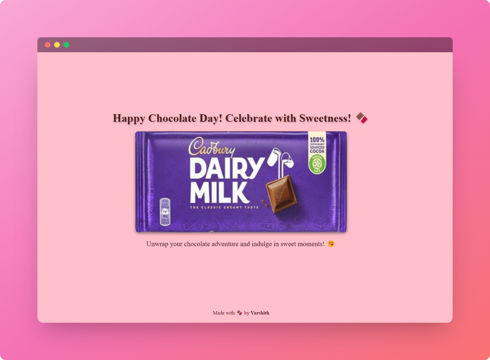

# Chocolate Day Special 🍫
<!-- Add Image of website website_screenshot.png -->

Celebrate Chocolate Day with a delightful virtual chocolate experience! Unwrap, savor, and enjoy the sweetness of chocolate right from your screen.

## Features

- **Interactive Chocolate Bar**: Drag to unwrap and click to enjoy each piece.
- **Daily Limit**: Enjoy up to two full chocolate bars per day.
- **Responsive Design**: Works seamlessly on both desktop and mobile devices.
- **Fun Animations**: Engaging animations and effects for a delightful experience.
- **Cursive Branding**: Elegant "Cadbury" text on each piece.

## Demo


Check out the live demo [here](https://chocolate-day-special.vercel.app/).

## Installation

1. **Clone the Repository:**
   ```bash
   git clone https://github.com/Varshithvhegde/Chocolate_Day.git
   cd Chocolate_Day
   ```

2. **Open `index.html` in Your Browser:**
   Simply open the file in your favorite web browser to start enjoying the chocolate experience.

## Usage

- **Unwrap**: Drag the wrapper to reveal the chocolate.
- **Eat**: Click on the pieces to enjoy them.
- **Limit**: You can eat up to two full bars per day.

## Technologies Used

- **HTML5**: For the structure of the app.
- **CSS3**: For styling and animations.
- **JavaScript**: For interactivity and logic.


## Contributing

Contributions are welcome! Please fork the repository and submit a pull request for any enhancements or bug fixes.

## License

This project is licensed under the MIT License.

## Credits

Made with 🍫 by [Varshith](https://github.com/Varshithvhegde).

---

Feel free to customize the README further to suit your project's needs! Let me know if you need any more help.
